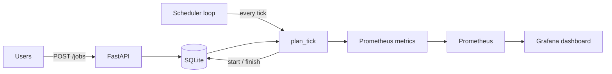

# Fair-Share GPU Scheduler


A job scheduler for a shared GPU cluster. Users submit jobs asking for GPUs and a
runtime estimate; the scheduler decides who runs next using fair-share priority,
and keeps the cluster busy with EASY backfill.

Job execution is **simulated**: a job holds its GPUs for its estimated runtime and
then releases them. The interesting part of a scheduler is the policy, not the
process launcher, and simulating execution makes the policy testable and
demonstrable without a cluster attached.

## The problem

A shared research cluster has more demand than GPUs. The naive answers break in
predictable ways:

- **First in, first out.** One user submits 100 jobs on Friday and everybody else
  waits until Monday.
- **Fair-share alone.** Push heavy users down and they can be starved forever by a
  steady trickle of jobs from light users.
- **No backfill.** A job needing all 8 GPUs blocks the queue while 6 GPUs sit idle
  waiting for the last two to free up.

This scheduler addresses all three.

## Scheduling policy

```
priority = W_FAIR * fairshare_factor + W_AGE * age_factor
```

**Fair-share factor**, bounded in `(0, 1]`, uses the formula Slurm uses:

```
F = 2 ** (-U / S)
```

`U` is the user's share of total cluster usage and `S` is the share they are
entitled to (an equal slice). Using exactly your entitlement gives `F = 0.5`,
using nothing gives `1.0`, using double gives `0.25`.

**Usage decays** with a half-life (default 7 days). Without decay, a user who ran
heavy training in January would still be paying for it in July. With it, recent
consumption dominates and old consumption fades.

**Age factor** grows with time spent queued and is **deliberately unbounded**. This
is what turns "a starved job eventually runs" from a hope into a guarantee: no
matter how far a user's fair-share has sunk, waiting long enough outweighs it.
Slurm caps the equivalent term (`PriorityMaxAge`), which bounds how much age can
distort fairness but gives up the guarantee. This trade goes the other way.

**EASY backfill.** When the highest-priority job does not fit in the free GPUs, the
cluster is not left idle. The scheduler computes when enough GPUs will be released
for that job (its *reservation*), then lets lower-priority jobs run in the gap,
but only those expected to finish **before** the reservation. A backfilled job can
therefore never delay the job it jumped ahead of.

## Architecture



`plan_tick` is a pure function: given the jobs and the wall clock, it returns which
jobs to finish and which to start. It touches no database and no global clock,
which is what makes fairness and backfill behaviour straightforward to test.

## Quick start

```bash
pip install -r requirements.txt
uvicorn src.serve:app --reload
```

Or bring up the scheduler with its monitoring stack:

```bash
docker compose up --build
```

| Service | URL |
|---|---|
| API | http://localhost:8000 |
| Swagger docs | http://localhost:8000/docs |
| Prometheus | http://localhost:9090 |
| Grafana | http://localhost:3000 (admin / admin) |

CI publishes the API image to GHCR on every push to `main`:

```bash
docker pull ghcr.io/yigitliman/gpu-scheduler:latest
```

## Seeing backfill work

With a 4-GPU cluster, occupy two GPUs for 20 seconds, then queue a job that needs
all four:

```bash
curl -X POST localhost:8000/jobs -H 'Content-Type: application/json' \
  -d '{"user":"rita","gpus":2,"est_seconds":20}'
curl -X POST localhost:8000/jobs -H 'Content-Type: application/json' \
  -d '{"user":"amir","gpus":4,"est_seconds":5}'    # cannot fit: reserved for t+20
curl -X POST localhost:8000/jobs -H 'Content-Type: application/json' \
  -d '{"user":"bea","gpus":1,"est_seconds":3}'     # finishes before the reservation
curl -X POST localhost:8000/jobs -H 'Content-Type: application/json' \
  -d '{"user":"cai","gpus":1,"est_seconds":40}'    # would overrun it

curl localhost:8000/cluster
```

Bea's job backfills into the gap and runs. Cai's job does not, and one GPU is left
deliberately idle rather than delay Amir. `GET /queue` shows the priority
components that produced that ordering.

## What backfill is worth

`benchmarks/backfill.py` pushes one synthetic workload through the scheduler
twice (strict priority order, then EASY backfill) and reports the difference.
400 jobs across 5 users on 8 GPUs, mixed 1-to-8-GPU shapes, fixed seed:

| Metric | Strict priority | EASY backfill | Change |
|---|---:|---:|---:|
| GPU utilisation | 89.5% | 99.5% | **+11.2%** |
| Makespan | 258.5 h | 232.4 h | **-10.1%** |
| Mean queue wait | 109.6 h | 87.9 h | **-19.8%** |
| Median queue wait | 119.8 h | 98.1 h | **-18.1%** |
| p95 queue wait | 206.1 h | 179.6 h | **-12.9%** |

```bash
python benchmarks/backfill.py
```

The cluster is simulated and jobs run for exactly their estimate, so this
isolates the scheduling policy. It is not a measurement of a real cluster,
where overrunning estimates erode the reservation guarantee (see below). The
gain comes from the 8-GPU jobs: under strict priority they stall the queue
behind them, and the idle GPUs in that gap are what backfill reclaims.

## API

| Method | Endpoint | Description |
|---|---|---|
| GET | `/health` | Readiness probe |
| POST | `/jobs` | Submit a job |
| GET | `/jobs` | List jobs, optionally filtered by state |
| GET | `/jobs/{id}` | One job |
| DELETE | `/jobs/{id}` | Cancel a queued or running job |
| GET | `/queue` | Queue in scheduling order, with fair-share and priority per job |
| GET | `/cluster` | GPU allocation and utilization |
| GET | `/usage` | Decayed GPU-hours per user, the accounting behind fair-share |
| GET | `/metrics` | Prometheus metrics |

## Monitoring

Exported metrics answer the two questions a cluster operator actually has: are the
GPUs busy, and is anyone waiting much longer than everyone else.

- `cluster_gpus_allocated` / `cluster_gpus_total` for utilization
- `scheduler_queue_depth`, `scheduler_running_jobs`
- `scheduler_queue_wait_seconds` histogram, for wait-time percentiles
- `scheduler_user_decayed_gpu_hours{user}`, so the fairness decisions are auditable
  from a dashboard rather than only from the code

## What this does not do

Being explicit about the edges, because they are where the interesting questions
live:

- **Single instance only.** Two schedulers pointed at the same database would each
  compute free capacity independently and could over-allocate the cluster. Running
  more than one requires leader election or moving allocation into a transaction.
- **Reservations trust user estimates.** A job that overruns its estimate delays the
  job it was reserved for. Slurm has the same weakness and answers it by killing
  jobs at their time limit. Here nothing is killed, so an overrun simply pushes the
  reservation back.
- **No preemption.** A long low-priority job cannot be suspended to let a
  high-priority one through.
- **No GPU topology.** GPUs are interchangeable units. A real cluster cares about
  NVLink islands and NUMA locality, so a 4-GPU job wants four GPUs on one board.
- **Usage is recomputed from the full job history on every tick.** Clear and easy to
  test, O(jobs) per tick. A production system would keep an incrementally decayed
  accumulator per user.
- **Execution is simulated.** No processes are launched and no GPUs are touched.

## Tests

The properties the scheduler claims are asserted, not assumed: fair-share maths,
half-life decay, that a starved user is eventually rescued by aging, that GPUs are
never over-allocated, that a short job backfills, and that a long one is refused
because it would overrun the reservation.

```bash
pytest tests/ -v
```

## License

Released under the MIT License. See [LICENSE](LICENSE).
